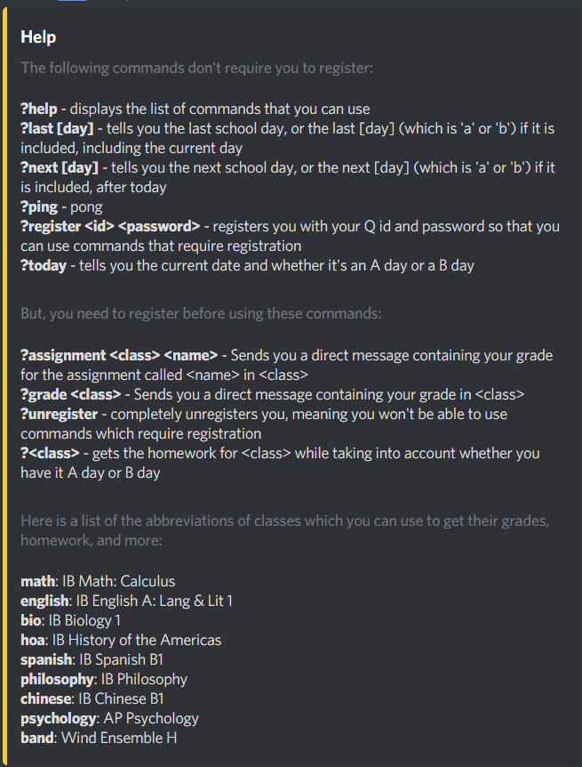

# school-discord-bot

A Discord bot that tracks school and homework information.

# Implementation

This bot uses Node.js and the discord.js package from npm. It also uses the mysql package to query the database that stores some student information.

# Available Commands

The image below displays the commands which can be used with this bot:
